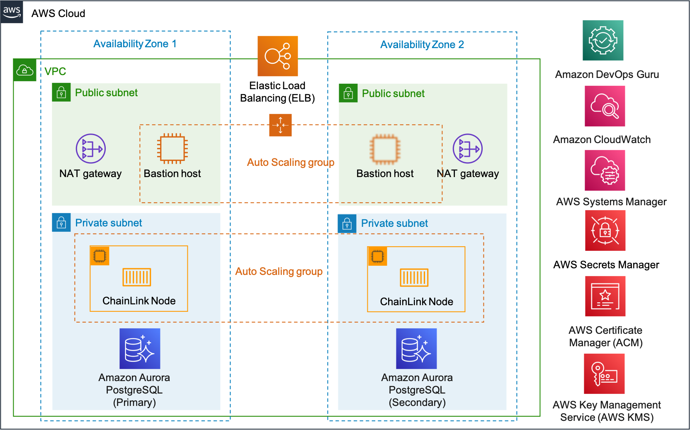

:xrefstyle: short

Deploying this Quick Start for a new virtual private cloud (VPC) with
default parameters builds the following {partner-product-short-name} environment in the
AWS Cloud.

// Replace this example diagram with your own. Follow our wiki guidelines: https://w.amazon.com/bin/view/AWS_Quick_Starts/Process_for_PSAs/#HPrepareyourarchitecturediagram. Upload your source PowerPoint file to the GitHub {deployment name}/docs/images/ directory in this repo. 

[#architecture1]
.Quick Start architecture for {partner-product-short-name} on AWS

As shown in <<architecture1>>, the Quick Start sets up the following:

* A highly available architecture that spans two Availability Zones.*
* A VPC configured with public and private subnets, according to AWS
best practices, to provide you with your own virtual network on AWS.*
* In the public subnets:
** An internet gateway to allow access to the internet.*
** Managed network address translation (NAT) gateways to allow outbound
internet access for the Chainlink node instances in the private subnets.*
** A Linux bastion host in an Auto Scaling group to allow inbound Secure
Shell (SSH) access to EC2 instances in public and private subnets.
* In the private subnets:
** Two Chainlink nodes in an Auto Scaling group.
** An Amazon Relation Database Service (Amazon RDS) PostgreSQL managed database instance.
// Add bullet points for any additional components that are included in the deployment. Make sure that the additional components are also represented in the architecture diagram. End each bullet with a period.
* Security groups for fine-grained inbound access control.
* An Elastic Load Balancing (ELB) load balancer to access the Chainlink node web graphical user interface.
* Amazon CloudWatch logging of Chainlink nodes.
* AWS managed keys and customer managed keys for resources with AWS Key Management Service (KMS).
* AWS Secrets Manager to store your credentials.

[.small]#* The template that deploys the Quick Start into an existing VPC skips the components marked by asterisks and prompts you for your existing VPC configuration.#
